<!--
File: README.md
Document Title: Welcome, Mortals — Static Portfolio Theme
Author: Alysha Pursley
Date: June 2026
-->

<div align="center">

# Welcome, Mortals — Static Portfolio Theme

**A theatrical haunted-house portfolio with orange highlights, eerie copy, custom cursors, and surprise spider energy.**

[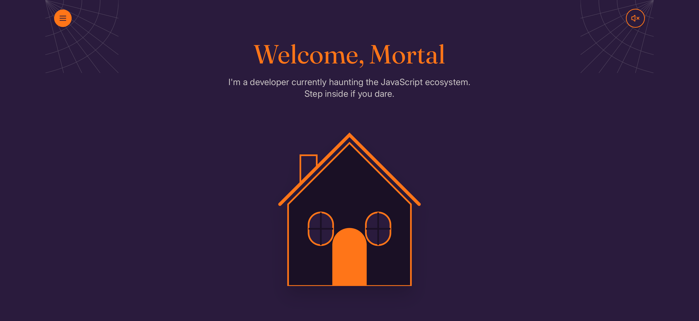](images/screenshots/welcome-mortals-screenshot-01.PNG)

[Open the live demo](https://apursley2012.github.io/welcome-mortals-github-pages-theme/) · [Browse the full theme collection](https://github.com/apursley2012/portfolio-themes-templates) · [Report an issue or request an addition](https://github.com/apursley2012/welcome-mortals-github-pages-theme/issues/new/choose)

</div>

---

## Table of Contents

- [Theme Overview](#theme-overview)
  - [Purpose](#purpose)
  - [Intended Users](#intended-users)
  - [Design Style and Inspiration](#design-style-and-inspiration)
  - [Main Color Palette](#main-color-palette)
  - [Preview Screenshots](#preview-screenshots)
- [Pages Included](#pages-included)
- [Component Architecture](#component-architecture)
  - [Shared Theme Components](#shared-theme-components)
  - [Shared Site Assets](#shared-site-assets)
  - [Theme-Specific Interactive Behavior](#theme-specific-interactive-behavior)
- [File and Folder Structure](#file-and-folder-structure)
- [Static Project Notes](#static-project-notes)
- [Customization Guide](#customization-guide)
  - [Personal Information and Branding](#personal-information-and-branding)
  - [Biography and Life Story](#biography-and-life-story)
  - [Projects, Skills, Services, and Experience](#projects-skills-services-and-experience)
  - [Contact Information and Social Links](#contact-information-and-social-links)
  - [Images and Screenshots](#images-and-screenshots)
  - [Colors, Fonts, and Styling](#colors-fonts-and-styling)
  - [Navigation](#navigation)
  - [Theme-Specific Editing Checklist](#theme-specific-editing-checklist)
- [GitHub Pages Deployment](#github-pages-deployment)
  - [Required Repository Structure](#required-repository-structure)
  - [Upload the Theme Files](#upload-the-theme-files)
  - [Enable GitHub Pages](#enable-github-pages)
  - [Confirm the Published URL](#confirm-the-published-url)
  - [Update the Published Site](#update-the-published-site)
  - [Important GitHub Pages Files](#important-github-pages-files)
  - [Common GitHub Pages Problems](#common-github-pages-problems)
- [Reporting Theme Issues or Requesting Additions](#reporting-theme-issues-or-requesting-additions)
- [Accessibility and Browser Compatibility](#accessibility-and-browser-compatibility)
  - [Accessibility Considerations](#accessibility-considerations)
  - [Browser Compatibility](#browser-compatibility)
- [Repository Relationship](#repository-relationship)
- [Possible Future Enhancements](#possible-future-enhancements)
- [Copyright](#copyright)

---

## Theme Overview

### Purpose

**Welcome, Mortals** is a reusable static portfolio theme that transforms a standard professional portfolio into a playful haunted attraction. The design uses a dark purple backdrop, Halloween-orange highlights, parchment-like text surfaces, lime accents, custom cursor treatment, and a spider-scare component. Its content structure remains practical: visitors can still find an introduction, biography, projects, skills, articles, writing, case studies, testimonials, work history, and contact information.

This theme can be opened locally, hosted with GitHub Pages, or adapted into a standalone personal website. The included files are ready to publish directly from a GitHub repository.

### Intended Users

This theme is best suited to portfolio owners who want a site with a defined personality rather than a generic landing-page layout. It can be adapted for software development, design, technical writing, digital art, creative work, freelance services, coursework, personal projects, or a combination of professional and personal storytelling.

### Design Style and Inspiration

The theme borrows from haunted-house signage, Halloween party invitations, campy horror hosts, eerie storybook pages, and playful seasonal websites. Its tone is spooky but lighthearted rather than graphic or grim.

The theme should not be cleaned up into a completely different visual language unless the person using it intentionally wants to create a new variation. The unusual interface choices are part of the design. New content should be fitted into the existing structure while preserving the spacing, layout, contrast, and palette.

### Main Color Palette

| Color | Hex | Primary Use |
| --- | --- | --- |
| Haunted Purple | `#2A1B3D` | Primary background |
| Pumpkin Orange | `#FF7518` | Headings and Halloween accents |
| Parchment | `#F4F1E8` | Readable content surfaces |
| Lawn Green | `#7CFC00` | Bright accent details |
| White | `#FFFFFF` | High-contrast readable text |

### Preview Screenshots

The repository includes 19 preview screenshots. Click any image to open the full-size file.

- [Screenshot 01](images/screenshots/welcome-mortals-screenshot-01.PNG)
- [Screenshot 02](images/screenshots/welcome-mortals-screenshot-02.PNG)
- [Screenshot 03](images/screenshots/welcome-mortals-screenshot-03.PNG)
- [Screenshot 04](images/screenshots/welcome-mortals-screenshot-04.PNG)
- [Screenshot 05](images/screenshots/welcome-mortals-screenshot-05.PNG)
- [Screenshot 06](images/screenshots/welcome-mortals-screenshot-06.PNG)
- [Screenshot 07](images/screenshots/welcome-mortals-screenshot-07.PNG)
- [Screenshot 08](images/screenshots/welcome-mortals-screenshot-08.PNG)
- [Screenshot 09](images/screenshots/welcome-mortals-screenshot-09.PNG)
- [Screenshot 10](images/screenshots/welcome-mortals-screenshot-10.PNG)
- [Screenshot 11](images/screenshots/welcome-mortals-screenshot-11.PNG)
- [Screenshot 12](images/screenshots/welcome-mortals-screenshot-12.PNG)
- [Screenshot 13](images/screenshots/welcome-mortals-screenshot-13.PNG)
- [Screenshot 14](images/screenshots/welcome-mortals-screenshot-14.PNG)
- [Screenshot 15](images/screenshots/welcome-mortals-screenshot-15.PNG)
- [Screenshot 16](images/screenshots/welcome-mortals-screenshot-16.PNG)
- [Screenshot 17](images/screenshots/welcome-mortals-screenshot-17.PNG)
- [Screenshot 18](images/screenshots/welcome-mortals-screenshot-18.PNG)
- [Screenshot 19](images/screenshots/welcome-mortals-screenshot-19.PNG)

#### Screenshot Gallery

[](images/screenshots/welcome-mortals-screenshot-01.PNG)

[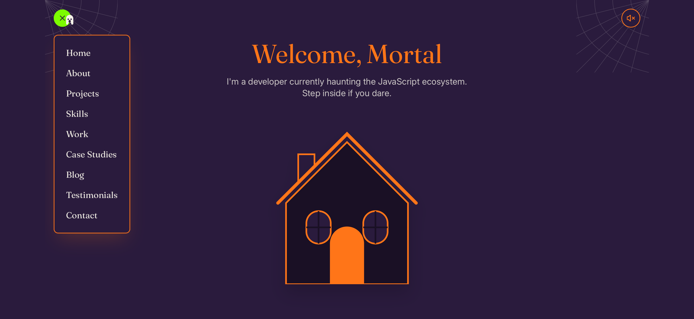](images/screenshots/welcome-mortals-screenshot-02.PNG)

[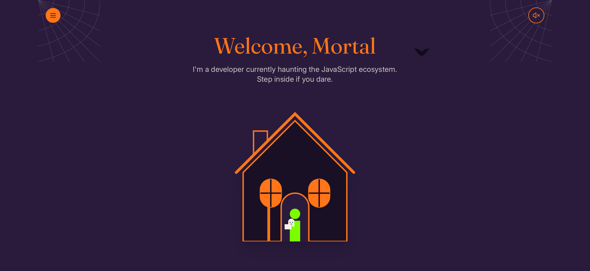](images/screenshots/welcome-mortals-screenshot-03.PNG)

[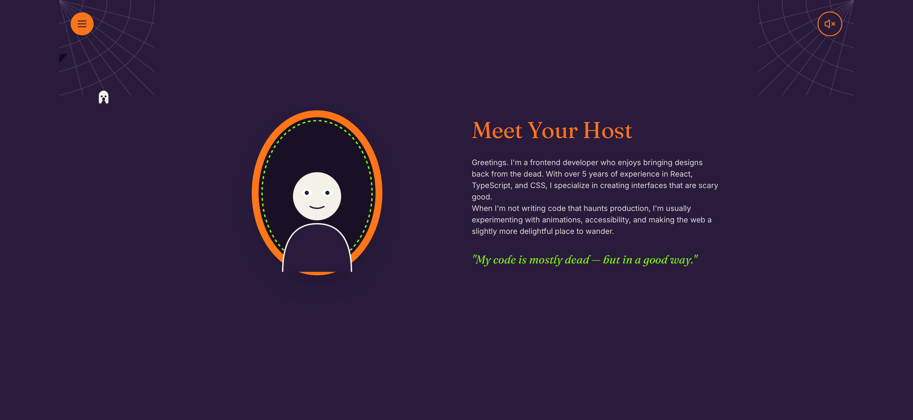](images/screenshots/welcome-mortals-screenshot-04.PNG)

[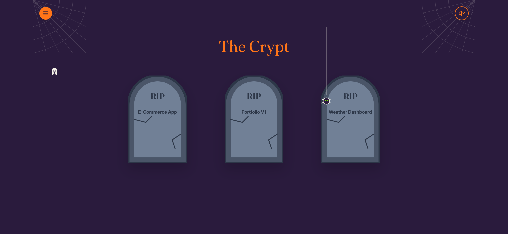](images/screenshots/welcome-mortals-screenshot-05.PNG)

[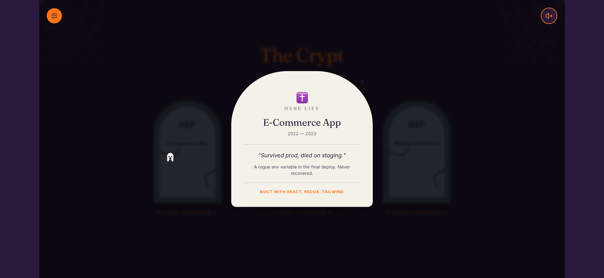](images/screenshots/welcome-mortals-screenshot-06.PNG)

[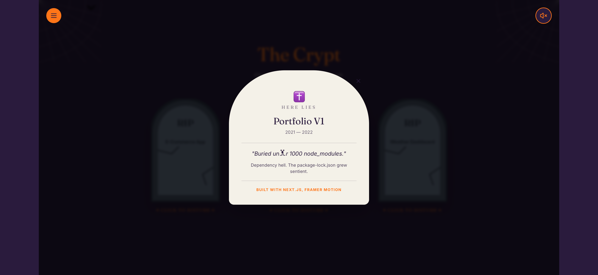](images/screenshots/welcome-mortals-screenshot-07.PNG)

[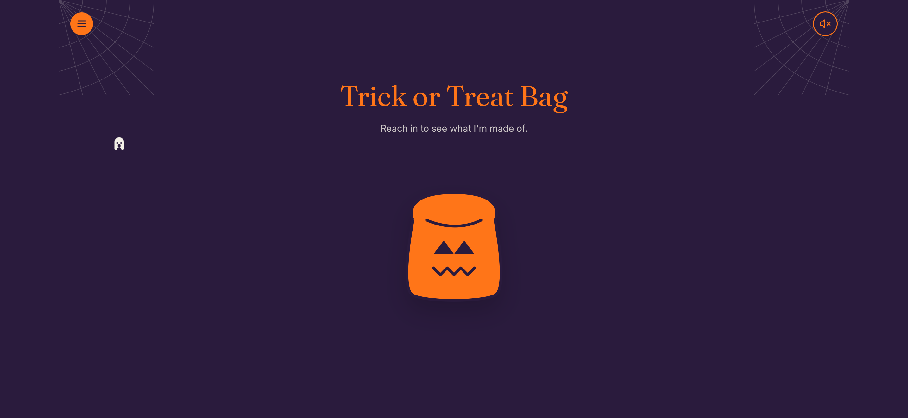](images/screenshots/welcome-mortals-screenshot-08.PNG)

[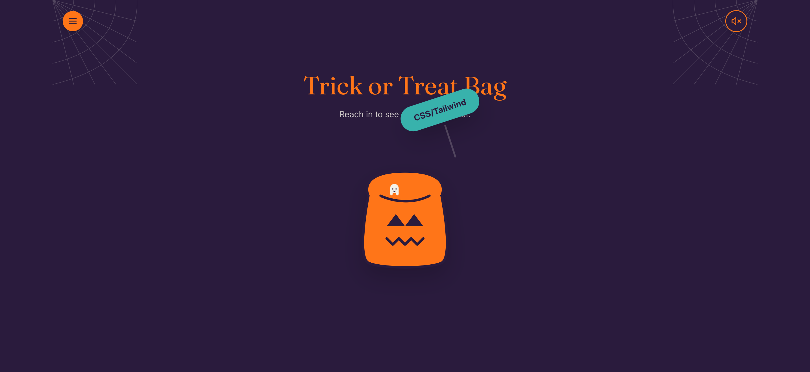](images/screenshots/welcome-mortals-screenshot-09.PNG)

[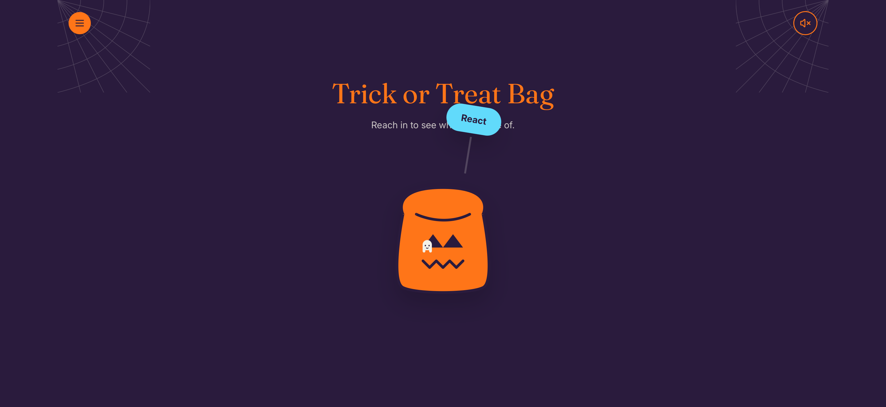](images/screenshots/welcome-mortals-screenshot-10.PNG)

[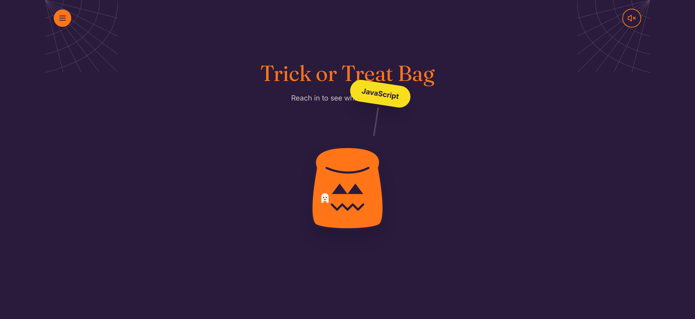](images/screenshots/welcome-mortals-screenshot-11.PNG)

[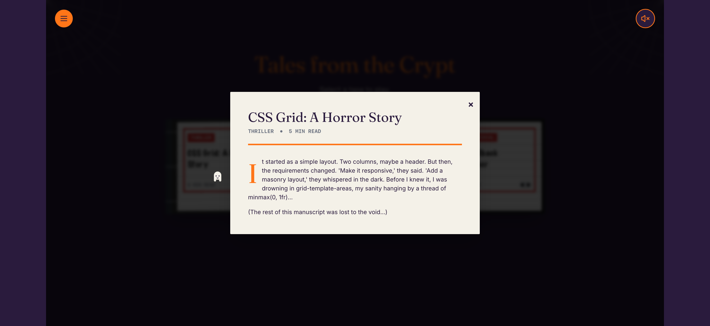](images/screenshots/welcome-mortals-screenshot-12.PNG)

[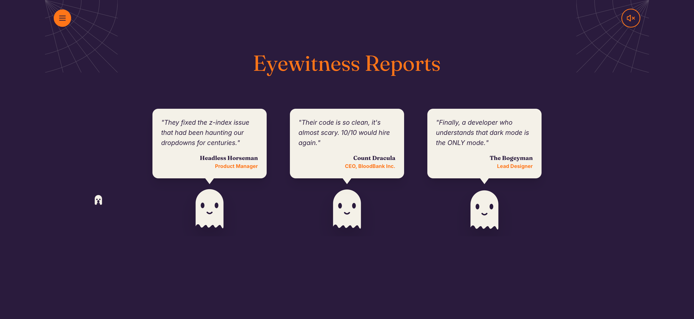](images/screenshots/welcome-mortals-screenshot-13.PNG)

[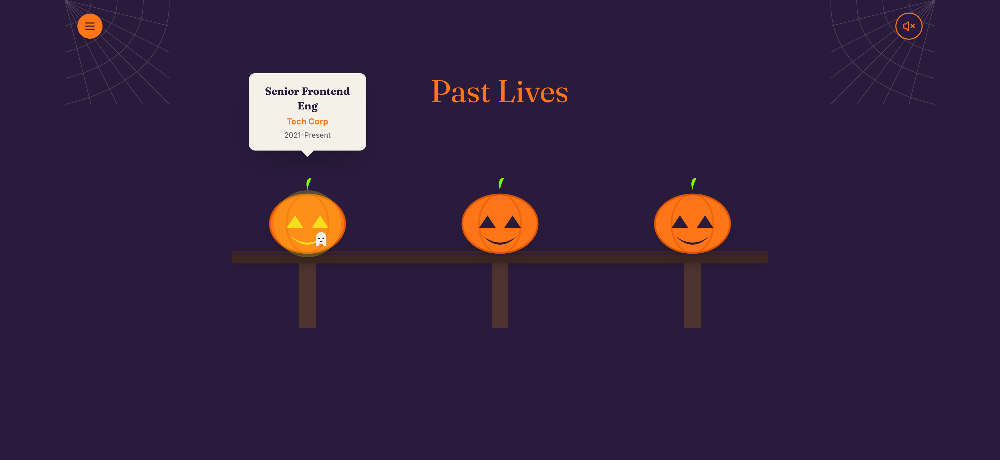](images/screenshots/welcome-mortals-screenshot-14.PNG)

[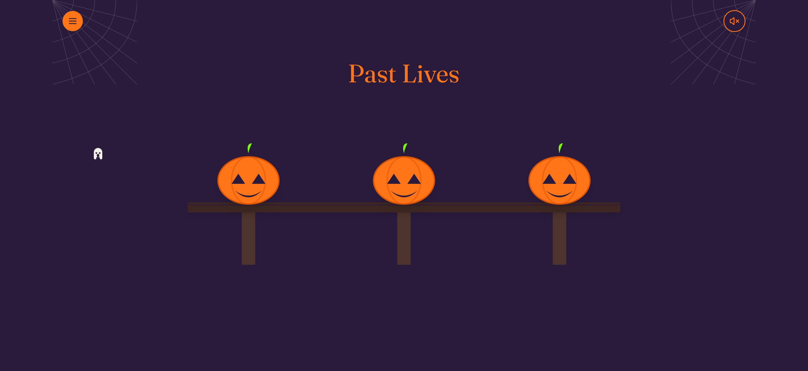](images/screenshots/welcome-mortals-screenshot-15.PNG)

[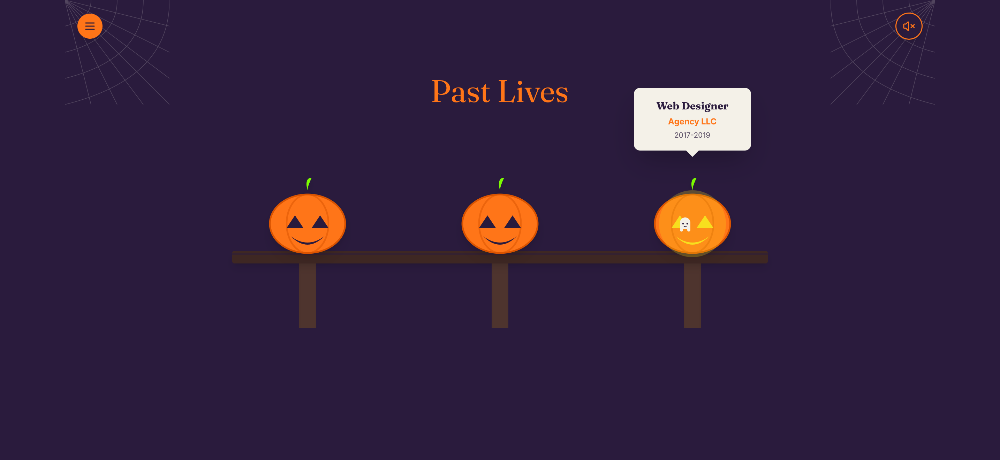](images/screenshots/welcome-mortals-screenshot-16.PNG)

[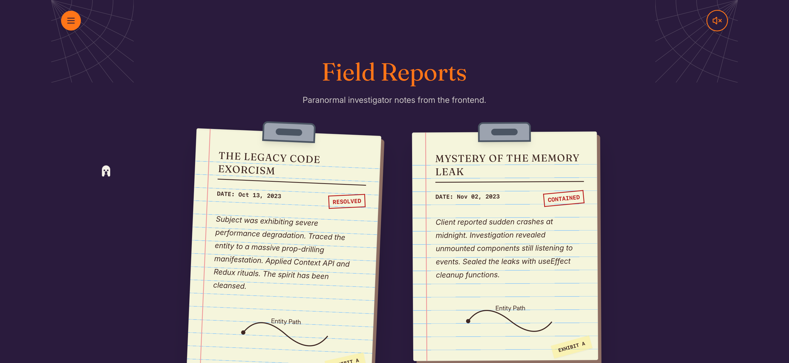](images/screenshots/welcome-mortals-screenshot-17.PNG)

[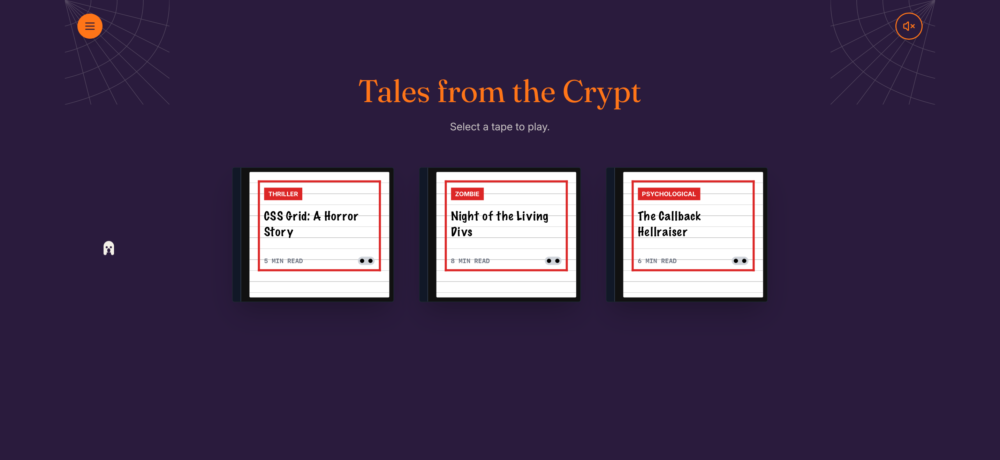](images/screenshots/welcome-mortals-screenshot-18.PNG)

[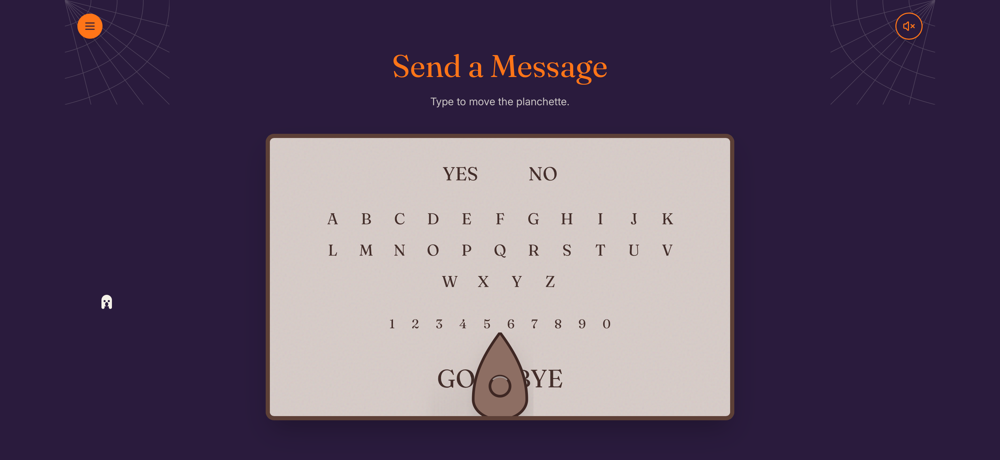](images/screenshots/welcome-mortals-screenshot-19.PNG)

---

## Pages Included

The portfolio pages are kept as separate HTML entry files.

| Page | Purpose |
| --- | --- |
| `index.html` | Main homepage and GitHub Pages entry file |
| `about.html` | Biography and background page |
| `projects.html` | Featured project portfolio |
| `work.html` | Professional experience and work-history page |
| `skills.html` | Skills, technologies, and capabilities page |
| `articles.html` | Article index |
| `writing.html` | Writing archive and long-form content page |
| `casestudies.html` | Detailed project and technical breakdowns |
| `testimonials.html` | Testimonials and feedback page |
| `contact.html` | Contact details and communication links |
| `placeholders.html` | Placeholder content used where additional content can be added later |

`index.html` is the only homepage file. A separate `home.html` file is not required.

---

## Component Architecture

### Shared Theme Components

The theme keeps reusable interactive files separated inside `components/`.

| Component | Purpose |
| --- | --- |
| `components/CustomCursor.js` | Controls the themed cursor behavior |
| `components/Layout.js` | Provides the shared page layout and navigation framing |
| `components/SpiderScare.js` | Controls the surprise spider interaction |
| `components/SpookHost.js` | Controls the horror-host presentation element |

### Shared Site Assets

| Asset | Purpose |
| --- | --- |
| `assets/main.css` | Main stylesheet, including layout, colors, typography, and visual effects |
| `assets/main.js` | Main site script |
| `assets/index.js` | Shared supporting script |
| `assets/jsx-runtime.js` | Shared supporting script |
| `assets/proxy.js` | Shared supporting script |

### Theme-Specific Interactive Behavior

- The custom cursor adds a themed pointer treatment.
- The spider-scare component provides the surprise interaction.
- Shared navigation framing is handled consistently across pages.
- Decorative effects are separated from the written portfolio content so text can be updated without redesigning the interface.

---

## File and Folder Structure

```text
welcome-mortals-github-pages-theme/
├── .github/
│   └── ISSUE_TEMPLATE/
│       ├── bug_report.md
│       ├── custom.md
│       └── feature_request.md
├── assets/
│   ├── index.js
│   ├── jsx-runtime.js
│   ├── main.css
│   ├── main.js
│   └── proxy.js
├── components/
│   ├── CustomCursor.js
│   ├── Layout.js
│   ├── SpiderScare.js
│   └── SpookHost.js
├── images/
│   └── screenshots/
│       ├── welcome-mortals-screenshot-01.PNG
│       ├── welcome-mortals-screenshot-02.PNG
│       ├── welcome-mortals-screenshot-03.PNG
│       ├── welcome-mortals-screenshot-04.PNG
│       ├── welcome-mortals-screenshot-05.PNG
│       ├── welcome-mortals-screenshot-06.PNG
│       ├── welcome-mortals-screenshot-07.PNG
│       ├── welcome-mortals-screenshot-08.PNG
│       ├── welcome-mortals-screenshot-09.PNG
│       ├── welcome-mortals-screenshot-10.PNG
│       ├── welcome-mortals-screenshot-11.PNG
│       ├── welcome-mortals-screenshot-12.PNG
│       ├── welcome-mortals-screenshot-13.PNG
│       ├── welcome-mortals-screenshot-14.PNG
│       ├── welcome-mortals-screenshot-15.PNG
│       ├── welcome-mortals-screenshot-16.PNG
│       ├── welcome-mortals-screenshot-17.PNG
│       ├── welcome-mortals-screenshot-18.PNG
│       └── welcome-mortals-screenshot-19.PNG
├── .nojekyll
├── about.html
├── articles.html
├── casestudies.html
├── contact.html
├── index.html
├── placeholders.html
├── projects.html
├── skills.html
├── testimonials.html
├── work.html
├── writing.html
└── README.md
```

The folders work together as follows:

- `index.html` is the main homepage and GitHub Pages entry file.
- The remaining root-level `.html` files keep the portfolio sections separately accessible.
- `components/` contains shared interactive theme files.
- `assets/main.css` contains the theme styling.
- `assets/` contains the shared site scripts.
- `images/screenshots/` contains repository preview images.
- `.github/ISSUE_TEMPLATE/` contains forms for reporting problems and requesting additions.
- `.nojekyll` tells GitHub Pages to publish the files directly.

---

## Static Project Notes

This project is designed for direct static hosting.

- The homepage is `index.html`.
- The portfolio sections have separate HTML entry files.
- Shared styles are stored in `assets/main.css`.
- Shared scripts remain separated inside `assets/` and `components/`.
- Internal file paths are relative so the theme works correctly at its GitHub Pages project URL.
- No additional configuration file is required for the recommended GitHub Pages setup.

---

## Customization Guide

### Personal Information and Branding

Start with `index.html`. Update the displayed portfolio-owner name, professional headline, homepage introduction, and any themed labels that should reflect the new owner's voice.

### Biography and Life Story

Update the biography content presented through the About page. This is the best place to explain the portfolio owner's background, goals, interests, career transition, education, creative influences, or personal approach to work.

### Projects, Skills, Services, and Experience

Use the following page files as the primary locations for the corresponding content:

- `projects.html` for featured work, repositories, screenshots, descriptions, and links
- `skills.html` for languages, tools, technologies, and capabilities
- `work.html` for professional experience
- `casestudies.html` for detailed project breakdowns
- `articles.html` and `writing.html` for articles, notes, papers, and long-form writing
- `testimonials.html` for testimonials and feedback
- `placeholders.html` for content that still needs to be added or replaced

### Contact Information and Social Links

Update the contact details presented through `contact.html`. Replace email addresses, GitHub links, LinkedIn links, downloadable résumé links, and any other external profiles before publishing a personalized copy.

### Images and Screenshots

Store added images inside `images/` or a clearly named subfolder. Use readable filenames and update all matching paths.

The documentation screenshots are stored in:

```text
images/screenshots/
```

After personalizing the theme, replace the screenshots if the repository documentation should show the customized design.

### Colors, Fonts, and Styling

The theme's visual identity lives in:

```text
assets/main.css
```

Search for the documented palette values before changing colors. Use targeted edits rather than rewriting the entire stylesheet so spacing and layout behavior remain stable.

### Navigation

Test every navigation link after editing the theme. GitHub Pages paths are case-sensitive.

For the homepage, use:

```html
<a href="index.html">Home</a>
```

### Theme-Specific Editing Checklist

1. Replace the homepage introduction and portfolio-owner information.
2. Update the biography and background information.
3. Replace the default project, work-history, skills, case-study, writing, testimonial, and contact content.
4. Replace external profile links and downloadable file links.
5. Add or replace images while keeping filenames and paths consistent.
6. Update screenshots if the documentation should reflect a customized version.
7. Test the cursor, spider interaction, navigation, and mobile layout.
8. Confirm that `index.html` remains at the repository root.
9. Keep the empty `.nojekyll` file beside `index.html`.

---

## GitHub Pages Deployment

### Required Repository Structure

Upload the **contents** of the theme folder so `index.html` sits directly at the repository root.

Correct:

```text
welcome-mortals-github-pages-theme/
├── .nojekyll
├── index.html
├── assets/
├── components/
└── images/
```

Incorrect:

```text
welcome-mortals-github-pages-theme/
└── welcome-mortals-github-pages-theme/
    ├── index.html
    ├── assets/
    └── images/
```

### Upload the Theme Files

To upload through the GitHub website:

1. Create or open the repository.
2. Select **Add file**.
3. Select **Upload files**.
4. Drag the extracted theme files and folders into the upload area.
5. Confirm that `index.html` appears at the top level of the repository.
6. Confirm that `.nojekyll`, `assets/`, `components/`, and `images/` were uploaded.
7. Add a commit message.
8. Select **Commit changes**.

### Enable GitHub Pages

1. Open the repository on GitHub.
2. Select **Settings**.
3. Select **Pages** from the sidebar.
4. Under **Build and deployment**, choose **Deploy from a branch**.
5. Select:

   ```text
   Branch: main
   Folder: / (root)
   ```

6. Select **Save**.

### Confirm the Published URL

For a repository named:

```text
welcome-mortals-github-pages-theme
```

the live GitHub Pages URL is:

```text
https://apursley2012.github.io/welcome-mortals-github-pages-theme/
```

Open the URL and test the homepage, navigation, images, styling, and interactive details.

### Update the Published Site

Committed changes to the selected publishing branch are republished automatically.

To update files through the GitHub website:

1. Open the repository.
2. Open the file to edit.
3. Select the pencil-shaped **Edit this file** button.
4. Make the change.
5. Select **Commit changes**.
6. Refresh the live site after the update is published.

### Important GitHub Pages Files

#### `index.html`

`index.html` is the homepage and GitHub Pages entry file. It must remain at the repository root.

Do not rename it to `home.html`.

#### `.nojekyll`

`.nojekyll` is an empty file stored beside `index.html`. The filename is the instruction. It should remain completely empty.

Correct:

```text
.nojekyll
```

Incorrect:

```text
nojekyll
.nojekyll.txt
nojekyll.md
```

#### Why `_config.yml` Is Not Required

This theme does not require `_config.yml` or `config.yaml`. Keep `.nojekyll` at the repository root and publish from `main` and `/(root)`.

### Common GitHub Pages Problems

#### The site shows a 404 page

Confirm that:

1. GitHub Pages is enabled under **Settings** → **Pages**.
2. The selected source is `main` and `/(root)`.
3. `index.html` is at the repository root.
4. The files were not uploaded inside an unnecessary second folder layer.
5. The repository name in the live URL is correct.

#### The site is blank or missing styling

Confirm that:

1. The full `assets/` folder was uploaded.
2. The full `components/` folder was uploaded.
3. File paths were not changed.
4. Filenames and capitalization match exactly.

#### Images do not load

Confirm that:

1. The complete `images/` folder was uploaded.
2. Image filenames and paths match exactly.
3. `.PNG` capitalization has not been changed.

#### The homepage does not load automatically

Confirm that the homepage is named exactly:

```text
index.html
```

#### The `.nojekyll` file looks empty

That is correct. It is supposed to be empty.

#### Changes do not appear immediately

Confirm that:

1. The latest changes were committed to the selected branch.
2. The correct file was edited.
3. The browser is not showing a cached copy.
4. The live URL matches the repository name.

---

## Reporting Theme Issues or Requesting Additions

The repository includes issue templates inside:

```text
.github/ISSUE_TEMPLATE/
```

| File | Purpose |
| --- | --- |
| `bug_report.md` | Report broken links, missing images, layout problems, or unexpected behavior |
| `feature_request.md` | Request new pages, design options, interactions, or other additions |
| `custom.md` | Submit another type of request |

Visitors can select the appropriate form here:

[Report an issue or request an addition](https://github.com/apursley2012/welcome-mortals-github-pages-theme/issues/new/choose)

When reporting an issue, include the affected page, the browser or device being used, a description of what happened, and a screenshot when possible.

---

## Accessibility and Browser Compatibility

### Accessibility Considerations

The spider surprise should remain decorative. It should not block navigation, trap focus, or flash rapidly. Test the theme with reduced-motion preferences enabled. Keep orange and lime accents for emphasis rather than long sections of body text.

Before publishing a customized version, test:

- Keyboard navigation
- Link focus states
- Mobile-width behavior
- Image alternative text
- Heading order
- Reduced-motion preferences
- Color contrast
- Readability of decorative text

### Browser Compatibility

The project is intended for current versions of Chrome, Firefox, Safari, and Edge. Test the final personalized version on both desktop and mobile screens because decorative elements can make spacing changes more noticeable.

---

## Repository Relationship

This theme is maintained as a standalone repository and linked from the main Portfolio Themes Templates collection.

- Live GitHub Pages demo: `https://apursley2012.github.io/welcome-mortals-github-pages-theme/`
- Main Portfolio Themes Templates collection: `https://github.com/apursley2012/portfolio-themes-templates`

The main collection repository acts as a directory. It should link visitors to this theme's live demo and source repository.

Add an entry similar to this to the main collection README:

```md
## Welcome, Mortals

A theatrical haunted-house portfolio theme with orange highlights, eerie copy, custom cursors, and surprise spider energy.

[](https://apursley2012.github.io/welcome-mortals-github-pages-theme/)

- [Open live demo](https://apursley2012.github.io/welcome-mortals-github-pages-theme/)
- [View source repository](https://github.com/apursley2012/welcome-mortals-github-pages-theme)
- [Report an issue or request an addition](https://github.com/apursley2012/welcome-mortals-github-pages-theme/issues/new/choose)
```

---

## Possible Future Enhancements

- Add a visible reduced-motion option for visitors who prefer a calmer experience.
- Add seasonal alternate palettes.
- Create a themed `404.html` page that looks like a locked crypt door.
- Add optional screenshot thumbnails for the main theme collection.
- Add additional issue-form categories if the collection grows.

---

## Copyright

Copyright © 2026 Alysha Pursley. All rights reserved.

This theme and its documentation are maintained by Alysha Pursley. Review the repository license and any project-specific usage terms before redistributing modified versions.
